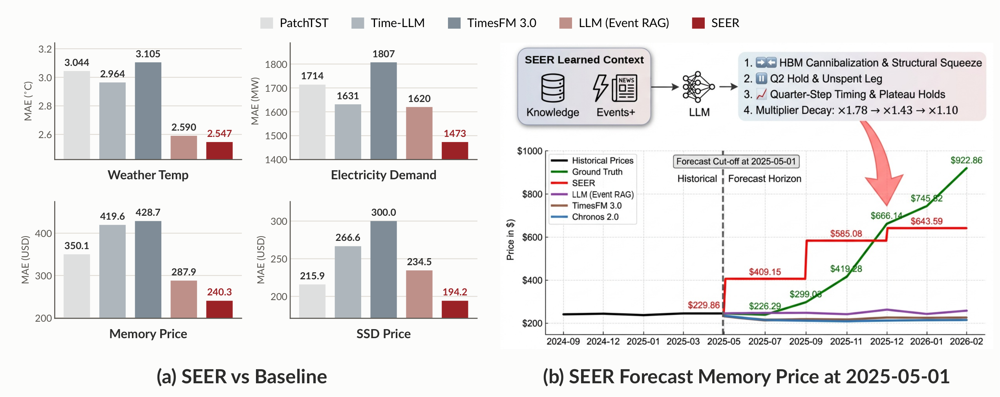
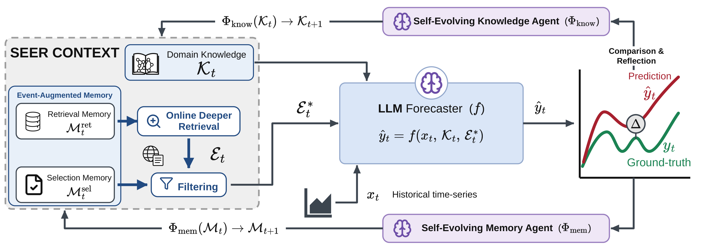

<div align="center">

<p>
  
  &nbsp;&nbsp;&nbsp;&nbsp;&nbsp;&nbsp;
  <picture>
    <source media="(prefers-color-scheme: dark)" srcset="assets/logos/uva-dark.svg">
    
  </picture>
</p>

# SEER: Self-Evolving Event Reasoning<br>and Retrieval for Time Series Forecasting

<picture>
  <source media="(prefers-color-scheme: dark)" srcset="assets/tagline-dark.svg">
  
</picture>

[](paper/SEER.pdf)
[](https://github.com/BennyTMT/SEER)
[](assets/cases/)

Mingtian Tan<sup>1,2</sup>,
Palash Goyal<sup>1</sup>,
Mihir Parmar<sup>1</sup>,
Sarkar Snigdha Sarathi Das<sup>1</sup>,
Chun-Liang Li<sup>1</sup>,
Nanyun Peng<sup>1</sup>,
Thomas Hartvigsen<sup>2</sup>,
Jinsung Yoon<sup>1</sup>,
Tomas Pfister<sup>1</sup>

<sup>1</sup>Google Cloud AI Research &nbsp;·&nbsp;
<sup>2</sup>University of Virginia

</div>

---

## News

- **Oct 2026** — Paper released: [paper (PDF)](paper/SEER.pdf).

## Overview

**In real-world forecasting tasks, historical numerical data alone is fundamentally insufficient**. Complex domains, such as Memory and SSD pricing, equities, electricity demand, weather, and event outcomes (e.g., Polymarket), are continually perturbed by policy shifts, supply disruptions, and breaking news. In these non-stationary regimes, crucial predictive signals reside outside the numerical sequence. While retrieval-augmented LLMs can access external events, standard pipelines fail to bridge this gap: they are hindered by noise, lack causal reasoning, and operate as static systems that never learn from past errors.


**SEER closes the loop**. Instead of updating the parameters of an LLM, SEER moves beyond static retrieval pipelines by continuously optimizing a pair of textual contexts for a frozen model. It transforms prediction errors into two decoupled textual updates: (i) a *reflective retrieval memory* that refines future queries and filters noisy events, and (ii) a *persistent forecasting knowledge* base that distills transferable domain dynamics. Evaluated in a rigorous setting that strictly respects forecast cut-offs to prevent look-ahead bias, SEER consistently outperforms state-of-the-art methods and standard LLMs across six volatile benchmarks, yielding accurate and naturally interpretable forecasts.


### SEER at a glance

<p align="center">
  
</p>

**(a) SEER vs. baselines**. We compare SEER with 15 baseline methods across three categories: supervised deep-learning models (e.g., PatchTST, iTransformer), LLM-based forecasters (e.g., Time-LLM, One-Fits-All), and zero-shot foundation models (TimesFM 3.0, Chronos-2). We also ablate the LLM backbone across settings with no events, standard Event RAG, and SEER without knowledge. Full results are provided in the paper.

**(b) An interpretable forecast.** *Input:* the monthly prices of 64GB DDR5 up to the 2025-05
cut-off, the retrieved events, and the six causal knowledge SEER learned from past forecasting.
*Output:* a reasoning chain and 9 monthly prices. SEER reads the events as an HBM-driven upside squeeze, and accurately predicts the future increase in RAM price. The full prompt and response are reproduced in
the [Case Studies](assets/cases/README.md).

### How SEER evolves

<p align="center">
  
</p>

At each cut-off *t* the frozen forecaster *f* sees the historical series *x<sub>t</sub>* together with
a **SEER context** that is itself the object of learning:

1. **Event-augmented memory.** A *retrieval memory* 𝓜<sup>ret</sup> formulates targeted follow-up searches that expand the local event pool 𝓔<sub>t</sub> with the signals earlier forecasts were missing; a *selection memory* 𝓜<sup>sel</sup> then filters the expanded pool down to the events that matter, 𝓔<sub>t</sub><sup>*</sup>.

2. **Domain knowledge.** A persistent set of causal forecasting knowledge 𝓚<sub>t</sub>, provided as textual context and inserted into the prompt, guides the forecaster on how similar events of each kind have moved the target in the past.

3. **Forecast.** r<sub>t</sub> = *f*(x<sub>t</sub>, 𝓚<sub>t</sub>, 𝓔<sub>t</sub><sup>*</sup>), where the forecaster generates an explicit reasoning process r<sub>t</sub> that intrinsically contains the final numerical prediction ŷ<sub>t</sub>.

4. **Comparison and reflection.** Once the ground-truth outcome y<sub>t</sub> is observed, SEER diagnoses the prediction error across the full forecasting trajectory (input, context, reasoning process r<sub>t</sub>, and actual outcome) and decouples the feedback: the **memory agent** Φ<sub>mem</sub> updates 𝓜 to address retrieval gaps and filter noisy events, while the **knowledge agent** Φ<sub>know</sub> refines 𝓚 to correct causal reasoning flaws. A condensation step merges redundant entries whenever a module approaches its capacity limit.

5. **Strict chronology.** To prevent look-ahead bias, every retrieved event is verified to have occurred on or prior to the forecast cut-off through the multi-agent fact-checking filter of [LEAF](https://arxiv.org/pdf/2605.16358), whose reliability has been validated by human expert audit; every reflection relies exclusively on outcomes already observable at that step. During evaluation, both memory and knowledge modules are strictly frozen, ensuring that test-time forecasts operate as pure inference. See the paper for the full backtesting protocol.


## Case studies

Complete model inputs and outputs for the cases discussed in the paper live in
[`assets/cases/`](assets/cases/).

## Citation

```bibtex
@article{tan2026seer,
  title   = {SEER: Self-Evolving Event Reasoning and Retrieval for Time Series Forecasting},
  author  = {Tan, Mingtian and Goyal, Palash and Parmar, Mihir and Das, Sarkar Snigdha Sarathi and
             Li, Chun-Liang and Peng, Nanyun and Hartvigsen, Thomas and Yoon, Jinsung and Pfister, Tomas},
  journal = {arXiv preprint},
  year    = {2026}
}
```
