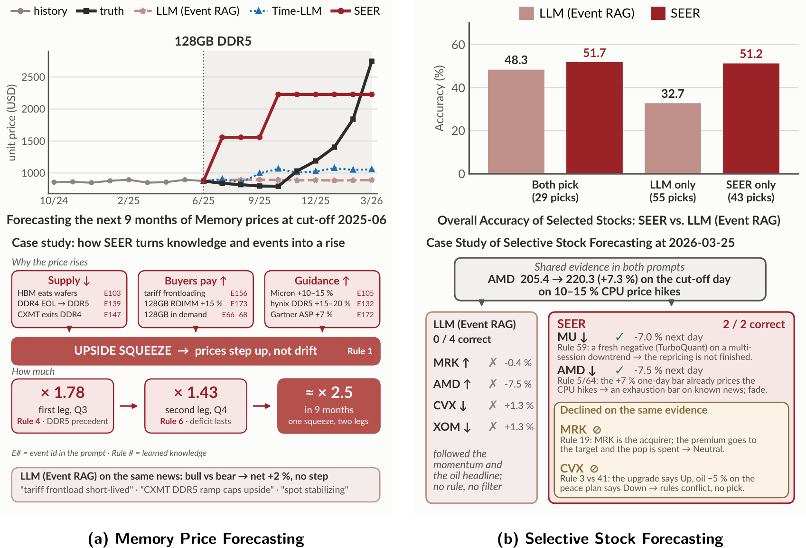

# Case studies

This folder holds the complete prompt/reasoning behind the qualitative cases in the paper:

| File | Case | In the paper | Model input | Model output |
|---|---|---|---|---|
| [`RAM-64GB-DDR5-2025-05.txt`](RAM-64GB-DDR5-2025-05.txt) | 64GB DDR5 memory price, cut-off 2025-05, 9-month horizon | Figure 1(b); appendix Figures 5–6 | 68 events, 6 knowledge rules | reasoning + 9 prices |
| [`RAM-128GB-DDR5-2025-06.txt`](RAM-128GB-DDR5-2025-06.txt) | 128GB DDR5 memory price, cut-off 2025-06, 9-month horizon | Figure 4(a); appendix Figures 15–16 | 66 events, 6 knowledge rules | reasoning + 9 prices |
| [`Stock-Basket50-2026-03-25.txt`](Stock-Basket50-2026-03-25.txt) | Selective stock forecasting, cut-off 2026-03-25, next trading day | Figure 4(b); appendix Figures 17–18 | 70 knowledge rules; 50 stock blocks (14-day closes + events) | analysis + picks |

## Figure 4 — interpretable forecasting of SEER

<p align="center">
  
</p>

**(a) Memory price forecasting.** While baseline models incorrectly extrapolated a nine-month price plateau for 128GB DDR5, SEER analyzed supply chain events (such as HBM wafer constraints and aggressive buying) and correctly identified an upside squeeze. Instead of predicting a slow drift, SEER anticipated a sharp price step-up. By applying its learned multipliers, SEER accurately forecasted the realized ~2.5x massive price surge. Full Content:
[`RAM-128GB-DDR5-2025-06.txt`](RAM-128GB-DDR5-2025-06.txt).

**(b) Selective stock forecasting.** In a daily task of forecasting up to six stocks, SEER significantly outperformed the baseline due to the high accuracy of its unique picks (51.2% vs. 32.7%). For example, on March 25, 2026, the baseline blindly followed market momentum and missed all of its predictions. In contrast, SEER successfully applied its learned experience to decode market nuances—such as identifying an exhaustion move (AMD), recognizing unfinished downward repricing (MU), and intelligently avoiding stocks with conflicting signals (MRK, CVX). As a result, SEER's selective predictions were entirely correct. Full Content: [`Stock-Basket50-2026-03-25.txt`](Stock-Basket50-2026-03-25.txt).

## How to read a transcript

Every file starts with a short header (task, item, cut-off, backbone, what the context contained)
followed by four parts:

```
[1] SYSTEM PROMPT   the task template
[2] USER PROMPT     the concrete input at this cut-off
[3] SEER OUTPUT     the model's reasoning and its final answer inside <prediction> / <predictions> tags
[4] REALISED ...    the ground truth
```

**Note:**

1. For the stock case, the system prompt contains the numbered knowledge rules, while the user prompt
   provides each (50 in total) stock's 14-day price history and candidate events.
2. Data sources: the RAM prices come from [Pangoly price trends](https://pangoly.com/en/price-trends/);
   the stock prices come from the [Yahoo Finance API](https://github.com/ranaroussi/yfinance).
3. The events are retrieved with the search mechanism of [LEAF](https://arxiv.org/pdf/2605.16358),
   whose fact-checking filter keeps only events that occurred on or before the forecast cut-off.
